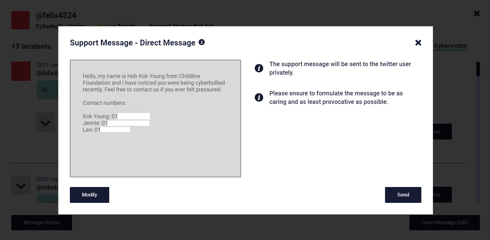

Cyberbullying Detection System (University Final Year Project)

This is a sentiment analysis-based cyberbullying messages detection from the platform Twitter, using Flask and React as the backbone behind the web application, catered for Malaysian government agencies and NGOs to warn and help the involved parties. This has been a year-long project that involves interviews with cybervictims, government agencies and NGOs to identify the core mechanisms required to combat never-ceasing cyberbullying cases in Malaysia.

Specifications:
1. Used the Tweepy library to enable continuous streams of tweets to facilitate detection, allowing agencies to message the parties directly to Twitter through the system.
2. Developed a custom sentiment analysis model independently, specializing in detecting cyberbullying messages in the unique code-switching style of Malaysian communication. Utilized tools such as Pandas, Matplotlib, scikit-learn, and TensorFlow, achieving an 88% recall score.
3. Visualized curated cyberbullying statistics using both bar charts (Chart.js) and state-level geographic representation (D3.js on a Malaysian map). This interactive solution enables users to easily identify and analyze the prevalence of cyberbullying incidents across different states.
4. Conducted an evaluation of both MongoDB and MySQL to determine their compatibility, stability, and implementation effort within the system, informing the decision-making process.
5. Implemented JWT-based user authentication with RBAC authorization for secure access control and enhanced performance by leveraging memoization techniques in React, optimizing data handling and minimizing unnecessary re-renders.
6. Encrypted any traceable user information using AES-256 to prevent the feeling of shame from cyberbullies or cybervictims in case of database breach.

The full documentation is under the file named Documentation.pdf in this repo, it involves all the process including the planning, reconnaissance, tech stack decisions, development, unit and UAT testing.

Do let me know if you want to know more about this project, email me at kokyoung1520@gmail.com